# Screenshots & Rundgang

Diese Seite zeigt einen geführten Rundgang durch CIDPbuddy — vom leeren Erststart bis zur vollständig eingerichteten App. Die Reihenfolge folgt dem typischen Onboarding-Pfad: ein erstes Medikament anlegen, einen Infusionsplan erstellen, Behandlungen erfassen und das Backup einrichten.

> Alle Screenshots stammen aus der deutschen Android-Version. Die Bilddateien liegen im Repository unter [`screenshots/`](../screenshots/).

## 1. Erster Start (leerer Zustand)

Direkt nach der Installation ist die App leer. Das Dashboard begrüßt mit „Alles erledigt!", die Medikationsliste ist noch ohne Einträge.

| Dashboard (leer) | Medikation (leer) |
|---|---|
| 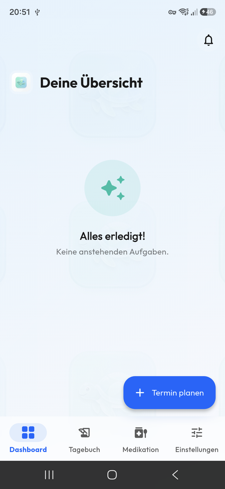 | 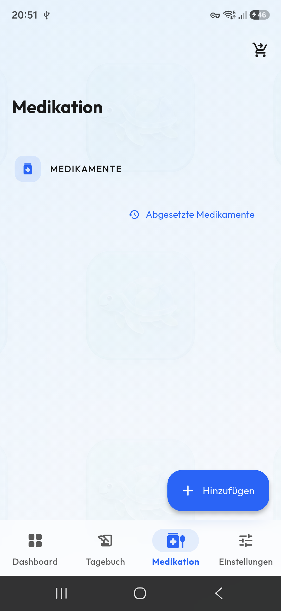 |

Das leere Dashboard zeigt den Begrüßungszustand „Deine Übersicht" mit dem Hinweis, dass keine anstehenden Aufgaben vorliegen. Über **+ Termin planen** beginnt die Einrichtung.

## 2. Erstes Medikament anlegen

| Neues Element | Medikament ausgefüllt | Infusionsplan erstellen |
|---|---|---|
| 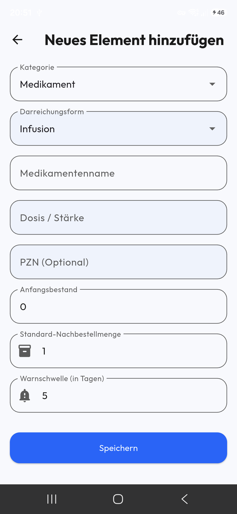 | 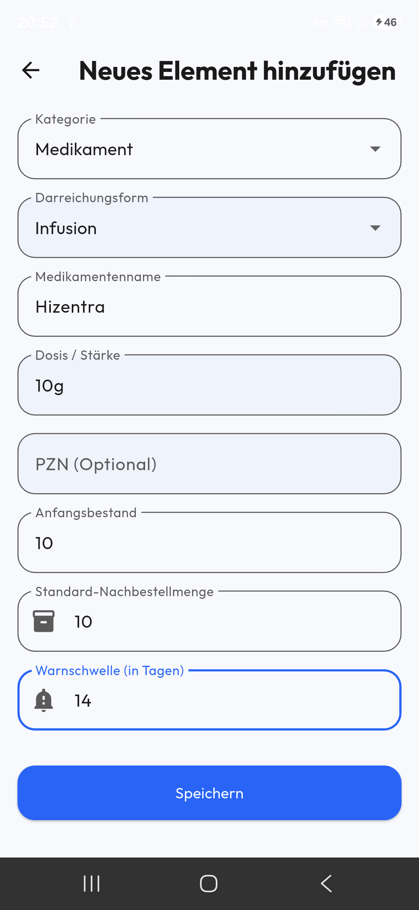 | 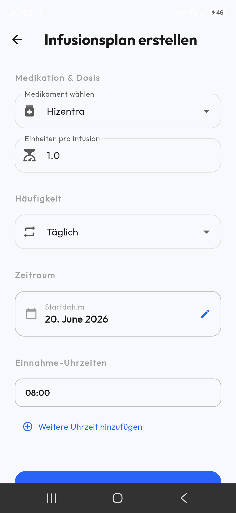 |

Im Formular wird ein neues Medikament angelegt (hier *Hizentra*) — mit Grunddaten wie Name, Dosis und Einheit. Anschließend wird ein **Infusionsplan** mit Frequenz (täglich, intervallbasiert, wöchentlich oder Wochentage) hinterlegt, aus dem der `SchedulerService` die 90-Tage-Planung generiert.

## 3. Dashboard mit Daten

| Dashboard | Dashboard (gescrollt) | Termin planen |
|---|---|---|
|  |  | 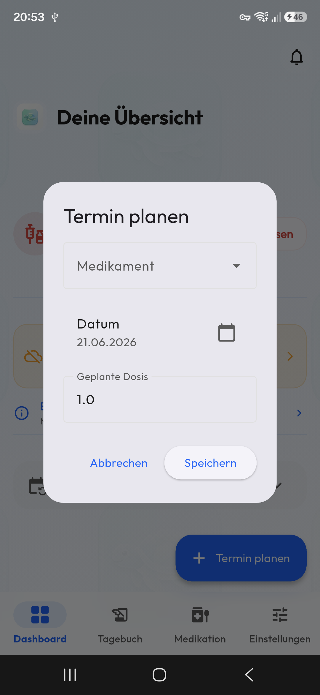 |

Sobald Medikament und Plan vorhanden sind, füllt sich das Dashboard:

- **Verpasste/anstehende Infusion** mit Schnellaktion **Jetzt Infusion erfassen**
- **Kein Backup aktiviert** — Hinweisbanner zur Datensicherung
- **Bestellung empfohlen** — Warnung bei niedrigem Bestand
- **Später geplant** — ausklappbare Liste kommender Termine aus dem 90-Tage-Plan

## 4. Tagebuch

| Tagebuch | Tagebuch (gescrollt) |
|---|---|
|  | 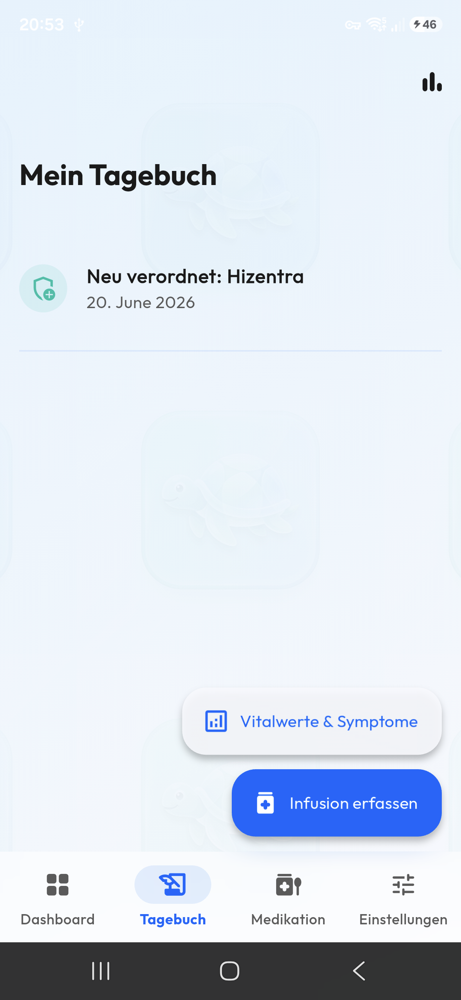 |

Das Tagebuch ist eine chronologische Timeline aller Ereignisse (Verordnungen, erfasste Infusionen, Tagebucheinträge, geplante Termine, Bestellungen). Über die Schnellaktionen lassen sich **Vitalwerte & Symptome** sowie eine **Infusion erfassen**.

## 5. Vitalwerte & Symptome erfassen

| Vitalwerte-Formular | Vitalwerte (gescrollt) |
|---|---|
|  | 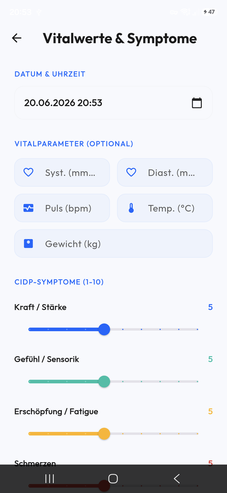 |

Erfasst werden Blutdruck (systolisch/diastolisch), Herzfrequenz, Temperatur und Gewicht sowie die CIDP-Symptomscores (je 0–10): Muskelkraft, Sensibilität, Fatigue, Schmerz und Balance.

## 6. Infusion erfassen

| Infusion erfassen | Infusion ausgefüllt |
|---|---|
| 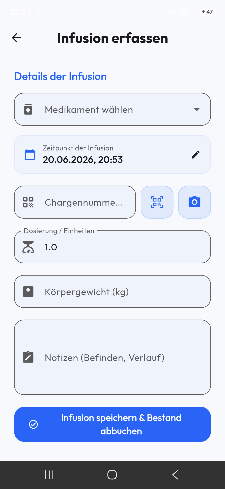 | 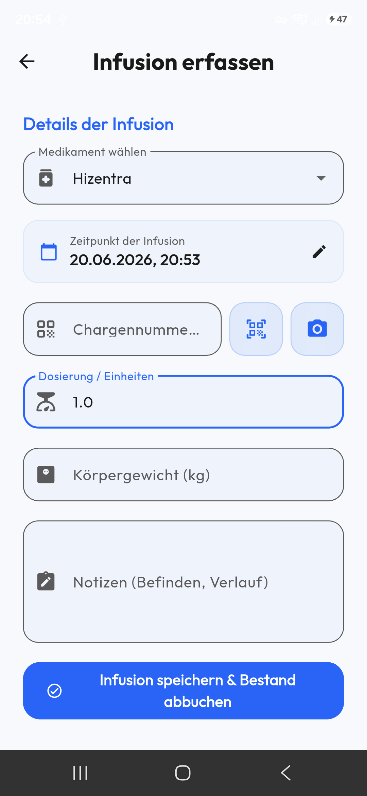 |

Beim Erfassen einer Infusion werden Datum, Uhrzeit und die (aus dem Plan vorbelegte) Dosis eingetragen — optional Chargennummer, Körpergewicht, Foto und Notizen. Beim Speichern werden Bestand und verknüpftes Zubehör transaktional abgezogen.

## 7. Medikation & Inventar

| Medikation | Hizentra-Details | Details (gescrollt) |
|---|---|---|
| 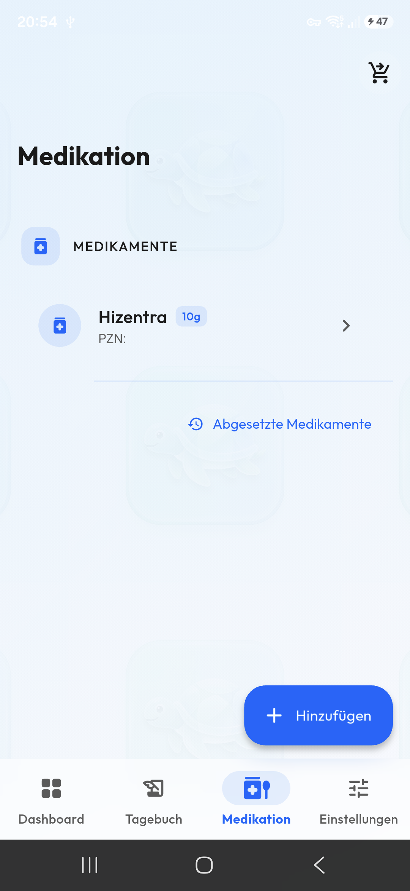 |  | 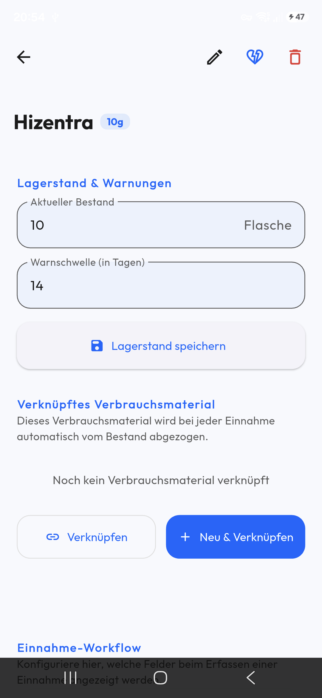 |

Die Medikationsliste zeigt eine farbcodierte Lagerampel mit Reichweite und nächstem Termin. In den Detailansichten lassen sich Grunddaten, Optionen (Chargennummern/Gewicht/Timer) und die Verbrauchsmaterial-BOM pflegen.

| Abgesetzte Medikamente | Verbrauchsmaterial-Formular | Medikation komplett |
|---|---|---|
| 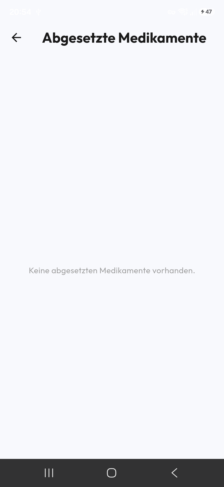 | 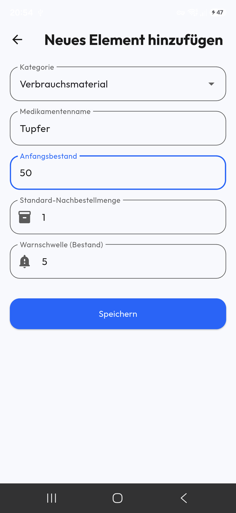 | 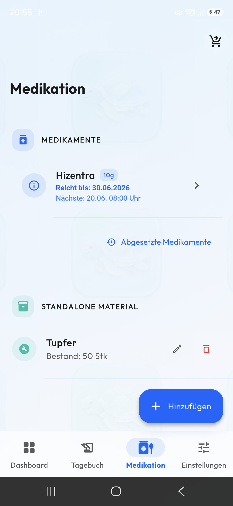 |

Neben aktiven Medikamenten lassen sich abgesetzte Präparate getrennt einsehen und Standalone-Verbrauchsmaterial (z. B. Tupfer) mit eigenem Bestand verwalten.

## 8. Einstellungen & Backup

| Einstellungen | Einstellungen (gescrollt) |
|---|---|
| 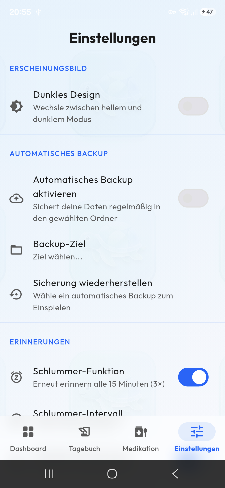 |  |

Die Einstellungen umfassen Erscheinungsbild (helles/dunkles Design), **automatisches Backup** (Ziel wählen, Sicherung wiederherstellen) und Erinnerungen (Schlummer-Funktion). Details zur Backup-Logik unter [Backup & Wiederherstellung](Backup-and-Restore).

## 9. Fertig eingerichtet

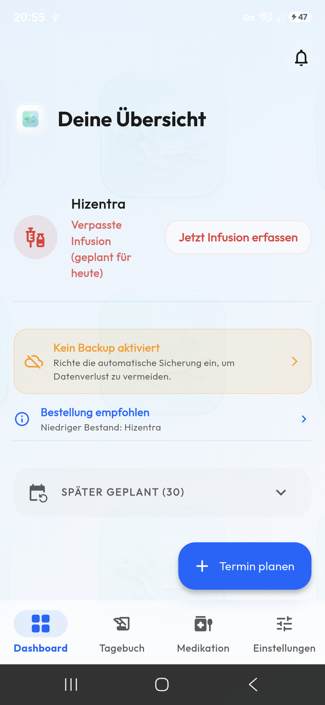

Das fertig eingerichtete Dashboard mit aktivem Plan, gepflegtem Bestand und konfiguriertem Backup.
